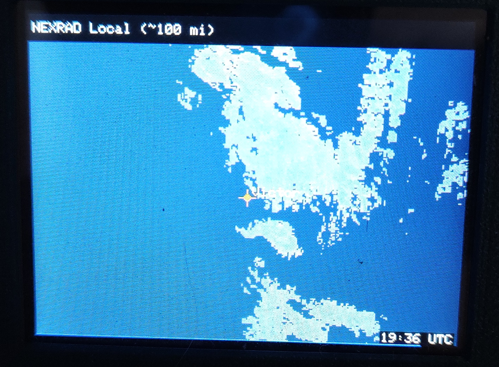
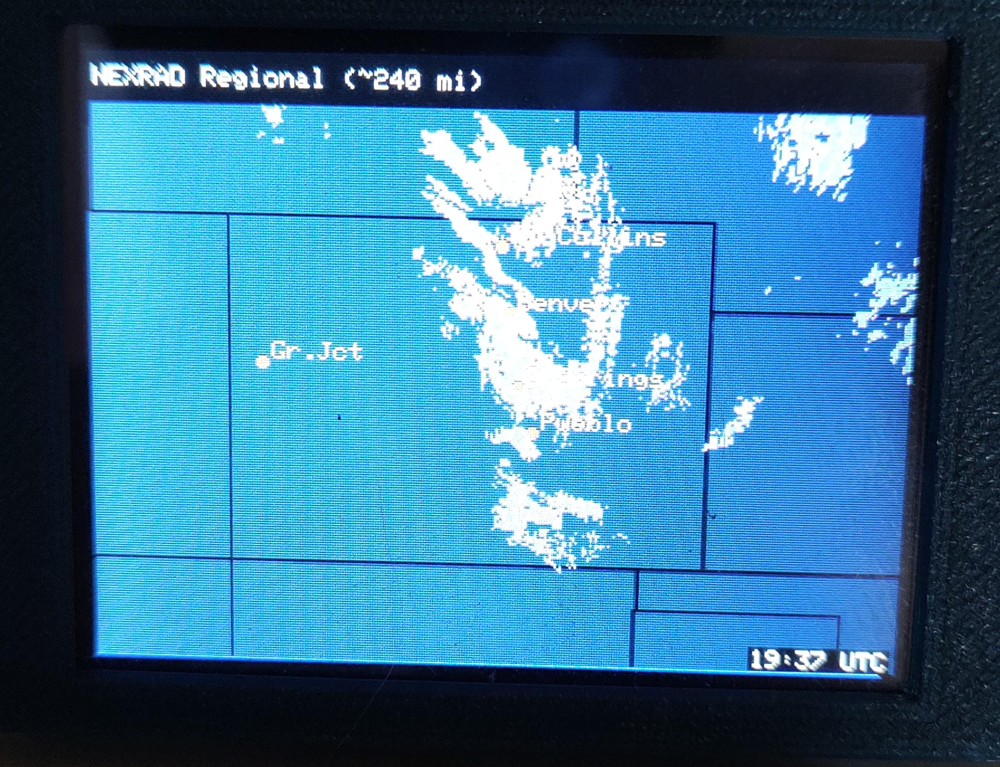
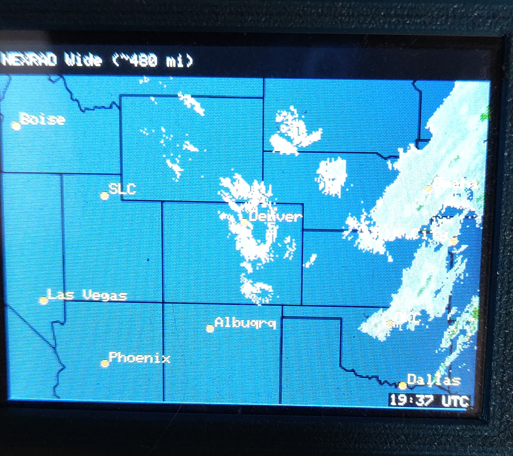
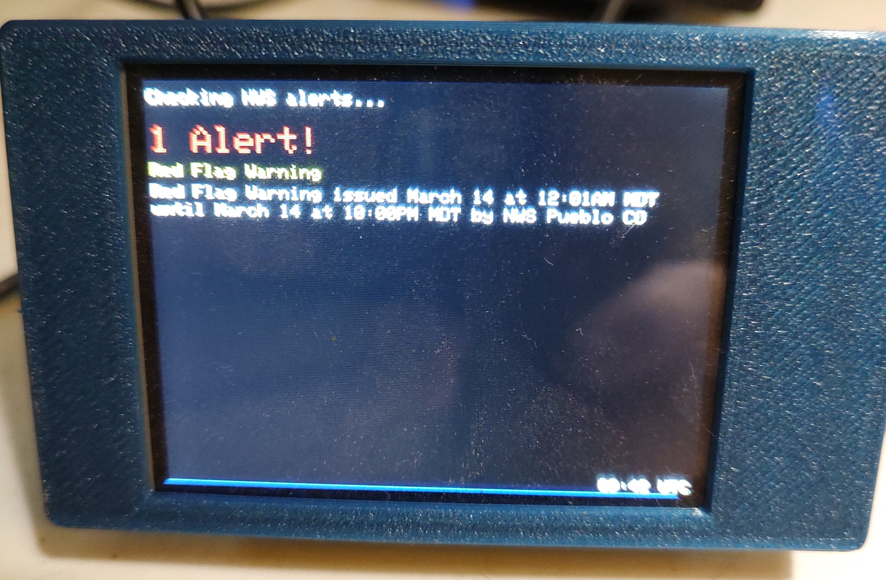

# RadarCore-CYD

**Live NOAA weather radar and NWS alerts for the ESP32 Cheap Yellow Display (CYD)**

Pulls the NOAA/NWS NEXRAD composite reflectivity mosaic directly onto a 320×240 ILI9341 display. Three zoom levels let you go from your backyard to a multi-state view. NWS active alerts are shown as a fourth mode. Everything is configured through a captive-portal web page on first boot — no code editing needed.

---

## Screenshots

| Local (~100 mi) | Regional (~240 mi) |
|:-:|:-:|
|  |  |
| Storm moving through — orange crosshair on home location | Storm corridor along the Front Range; Ft Collins, Denver, C.Springs, Pueblo, Gr.Jct labeled |

| Wide (~480 mi) | NWS Alerts |
|:-:|:-:|
|  |  |
| Multi-state view; Boise, SLC, Las Vegas, Phoenix, Denver, Albuqrq, Dallas labeled | Live Red Flag Warning from NWS Pueblo CO |

---

## Features

- **Live NOAA radar** — NEXRAD composite base reflectivity (CONUS), updated every ~5 minutes
- **Three zoom levels** — Local (~100 mi), Regional (~240 mi), Wide (~480 mi)
- **Dark map theme** — deep navy background with geopolitical borders, readable in any light
- **City markers** — orange crosshair on your home city (Local), labeled city dots on Regional
- **NWS Alerts** — fetches active weather alerts for your lat/lon from `api.weather.gov`
- **Captive-portal setup** — first boot opens a `NEXRADCore_Setup` WiFi access point; enter your WiFi credentials, lat/lon, and default mode from any browser
- **Touch navigation** — tap left third of screen = previous mode, right third = next mode
- **BOOT button** — short press cycles modes, long press (≥ 1.5 s) reopens setup
- **UTC clock** — timestamp drawn from NTP in the lower right corner
- **Refresh countdown bar** — 1 px progress bar at the bottom of the screen
- **Identity endpoint** — `GET http://<device-ip>/identify` returns JSON with device name, firmware version, uptime, RSSI, and last-fetch timestamp
- **INVERTED build** — separate `INVERTEDNexrad/` project for CYD units that require display inversion

---

## Hardware

| Component | Detail |
|-----------|--------|
| Board | ESP32 Dev Module (ESP32-2432S028R "Cheap Yellow Display") |
| Display | ILI9341 320×240 TFT, landscape |
| Touch | XPT2046 resistive touchscreen |
| Connectivity | 2.4 GHz WiFi (802.11 b/g/n) |

---

## Pinout (CYD standard — no wiring changes needed)

| Signal | GPIO |
|--------|------|
| Display DC | 2 |
| Display CS | 15 |
| SPI SCK | 14 |
| SPI MOSI | 13 |
| SPI MISO | 12 |
| Backlight | 21 |
| Touch CS | 33 |
| Touch IRQ | 36 |
| Touch CLK (VSPI) | 25 |
| Touch MISO (VSPI) | 39 |
| Touch MOSI (VSPI) | 32 |
| BOOT button | 0 |

---

## Setup

### 1 — Flash the firmware

Open the project in PlatformIO and upload. The first flash will take a moment to install dependencies automatically.

> If your CYD shows a colour-inverted display, flash the **`INVERTEDNexrad/`** project instead.

### 2 — Configure on first boot

1. On first boot the display shows setup instructions and the device broadcasts a WiFi AP named **`NEXRADCore_Setup`** (no password).
2. Connect to that network from your phone or laptop.
3. Open a browser and go to **`192.168.4.1`**.
4. Enter:
   - Your 2.4 GHz WiFi SSID and password
   - Your latitude and longitude (decimal degrees, e.g. `38.7172` / `-105.1364`)
   - Your preferred default mode
5. Tap **Save & Connect**. The device reboots into normal operation.

> To re-enter setup at any time, hold the **BOOT button** while powering on (or for 1.5 s during normal operation).

### 3 — Normal operation

The display refreshes radar every **5 minutes**. Touch or press BOOT to cycle modes at any time.

---

## Modes

| # | Name | Coverage | Refresh |
|---|------|----------|---------|
| 0 | Local | ~100 mi radius | 5 min |
| 1 | Regional | ~240 mi radius | 5 min |
| 2 | Wide | ~480 mi radius | 5 min |
| 3 | NWS Alerts | Your lat/lon zone | 5 min |

---

## City markers

City markers are drawn on top of the radar image after each decode. They are hardcoded for **Colorado** — update the `LOCAL_CITIES` and `REGIONAL_CITIES` arrays in `src/main.cpp` to match your location.

| Mode | Marker | Cities shown |
|------|--------|--------------|
| Local | Orange crosshair | Victor, CO |
| Regional | Orange dots + yellow labels | Victor, Denver, Ft Collins, C.Springs, Pueblo, Gr.Jct |
| Wide | None | — |

---

## Data sources

| Data | Source | URL |
|------|--------|-----|
| Radar mosaic | NOAA NWS GeoServer WMS | `opengeo.ncep.noaa.gov/geoserver/ows` |
| Radar layer | NEXRAD composite base reflectivity | `conus_bref_qcd` + `geopolitical` |
| NWS Alerts | weather.gov REST API | `api.weather.gov/alerts/active` |
| Time sync | NTP | `pool.ntp.org` / `time.nist.gov` |

Radar data covers the **contiguous United States (CONUS) only**.

---

## Dependencies

Managed automatically by PlatformIO:

| Library | Purpose |
|---------|---------|
| `moononournation/GFX Library for Arduino` @ 1.4.7 | ILI9341 display driver |
| `PaulStoffregen/XPT2046_Touchscreen` | Resistive touch driver |
| `bitbank2/PNGdec` | PNG image decoder |
| `bblanchon/ArduinoJson` ^ 6 | NWS Alerts JSON parsing |

---

## Project structure

```
NEXRADCYD/
├── src/
│   └── main.cpp          # Main application
├── include/
│   ├── HTTPS.h           # WiFiClientSecure HTTP fetch with stream reading
│   ├── JPEG.h            # PNGdec decoder instance
│   ├── NWSAlerts.h       # NWS alerts fetch and display
│   ├── Portal.h          # Captive-portal setup UI + NVS settings
│   └── CYDIdentity.h     # /identify JSON endpoint
├── INVERTEDNexrad/       # Alternate build for inverted CYD units
│   ├── src/main.cpp
│   ├── include/          # (hard-linked to parent include/)
│   └── platformio.ini
└── platformio.ini
```

---

## Identity endpoint

Once connected to WiFi the device serves a JSON endpoint on port 80:

```
GET http://<device-ip>/identify
```

```json
{
  "name": "NEXRADCore",
  "mac": "aa:bb:cc:dd:ee:ff",
  "version": "1.0.0",
  "uptime_s": 3721,
  "rssi": -62,
  "last_fetch": 1741942800,
  "errors": 0
}
```

---

## License

MIT — do whatever you like, attribution appreciated.
